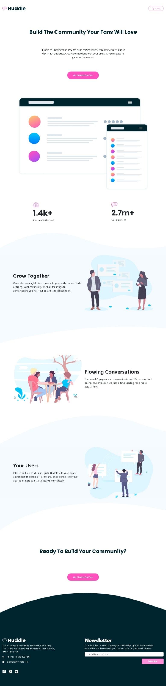

# DISEÑO DE LANDING PAGE CON HTML Y BOOTSTRAP 5 CSS CON FORMULARIO DE CONTACTO INCLUIDO USO ADICIONAL DE LIBRERÍA JS PARA ENVIÓ DE CORREOS ELECTRÓNICOS

## Vista previa del sitio web 📷

## Introducción al Repositorio ✏️

La siguiente landing pague o pagina de aterrizaje, esta diseñada para los retos creados en el sitio web:

 ### [FRONTENDMENTOR.IO](https://www.frontendmentor.io/challenges/huddle-landing-page-with-curved-sections-5ca5ecd01e82137ec91a50f2) 

La intención de este reto, es replicar la solicitud realizada en el sitio web usando, practicas correctas de html y css

## 1. - Librerías o framework usados: 📋

- Bootstrap 5
- Sass
- [Font Awesome](https://fontawesome.com/)

## 2. - Códigos de Colores y Fuentes:  🖌️ 🅰️

- Pink: hsl(322, 100%, 66%)
- Light Pink: hsl(321, 100%, 78%)
- Light Red: hsl(0, 100%, 63%)
- Very Dark Cyan: hsl(192, 100%, 9%)
- Very Pale Blue: hsl(207, 100%, 98%)
- White : hsl(100%, 100%, 100%)

- Family: [Poppins](https://fonts.google.com/specimen/Poppins)
- Weights: 700

- Family: [Open Sans](https://fonts.google.com/specimen/Open+Sans)
- Weights: 400, 600, 700

## 3. - Vista en vivo del sitio web:

### [$ Landing Page and Curve Using HTML, CSS & Js $](https://legendary-florentine-8dc274.netlify.app/)